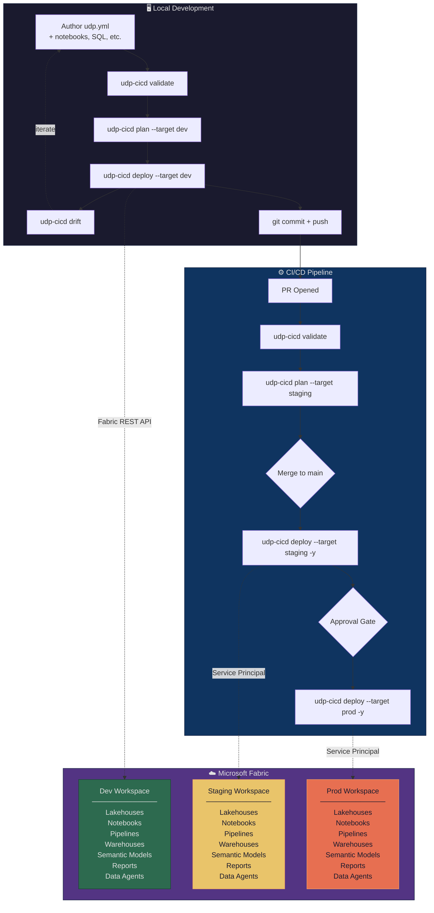

#  Unified Data Platform Deployment

[](https://www.nuget.org/packages/udp-cicd/)
[](https://dotnet.microsoft.com/)
[](https://github.com/PatrickGallucci/udp-cicd/blob/main/LICENSE)
[](https://github.com/PatrickGallucci/udp-cicd/actions)
[](https://PatrickGallucci.github.io/udp-cicd/)

> **Public Preview** — 30 item types verified against live Fabric API. Core workflows are production-ready. [See what's tested.](#tested-item-types)

**Project definition for Microsoft Unified Data Platform.** [Read the docs →](https://PatrickGallucci.github.io/udp-cicd/)

Define your entire Fabric project in a single `udp.yml` — lakehouses, notebooks, pipelines, semantic models, Data Agents, security roles, and environment targets — then validate, plan, and deploy with a single command.

```bash
udp-cicd init --template medallion --name udp-project
udp-cicd validate
udp-cicd plan
udp-cicd deploy --target prod
```

> **CLI naming:** The standalone CLI is `udp-cicd`. 

## The Problem

Project definition for Microsoft Unified Data Platform. The Fabric CLI can export and import items, `fabric-cicd` can deploy across workspaces, and Terraform/Bicep can provision infrastructure — but none of them describe:

- What resources your project needs (lakehouses, notebooks, pipelines, semantic models, Data Agents)
- How those resources depend on each other
- How configuration varies across environments (dev/staging/prod)
- What security roles and permissions are required
- How to deploy everything in the correct order

**Unified Data Platform Deployment fills that gap.**

## Quick Start

### Install

```bash
dotnet tool install --global udp-cicd
```

### Create a New Project

```bash
# Interactive wizard — pick a template, name, and capacity
udp-cicd init

# Or specify directly
udp-cicd init --template medallion --name udp-analytics
```

Available templates: `blank` (empty), `medallion` (bronze/silver/gold lakehouse)

### Or Generate from an Existing Workspace

```bash
udp-cicd generate --workspace "My Existing Workspace"
```

### Or Start from Scratch

```bash
mkdir udp-project && cd udp-project
```

Create a `udp.yml`:

```yaml
deployment:
  name: udp-project
  version: "1.0.0"

resources:
  lakehouses:
    my_lakehouse:
      description: "My data store"

targets:
  dev:
    default: true
    workspace:
      name: udp-project-dev
      capacity_id: "your-capacity-guid"
```

```bash
udp-cicd validate
udp-cicd deploy --target dev
```

This scans the workspace and produces a `udp.yml` you can customize — the fastest on-ramp for existing projects.

### Validate

```bash
udp-cicd validate
```

Validates all resource references, dependency chains, and target configurations.

### Plan (Dry-Run)

```bash
udp-cicd plan --target dev
```

Shows exactly what would change:

```
Deployment Plan: udp-analytics
  Target:    dev
  Workspace: udp-analytics-dev

  +  bronze-lakehouse      Lakehouse      create    New resource
  +  silver-lakehouse      Lakehouse      create    New resource
  +  gold-lakehouse        Lakehouse      create    New resource
  +  spark-env             Environment    create    New resource
  +  etl-bronze            Notebook       create    New resource
  +  etl-silver            Notebook       create    New resource
  +  daily-refresh         DataPipeline   create    New resource
  ~  analytics-model       SemanticModel  update    Definition updated

  Summary: 7 to create, 1 to update
```

### Deploy

```bash
udp-cicd deploy --target dev        # Deploy to dev (default)
udp-cicd deploy --target staging    # Deploy to staging
udp-cicd deploy --target prod -y   # Deploy to prod (skip confirmation)
```

### Destroy

```bash
udp-cicd destroy --target dev       # Tear down dev environment
```

### Try the CI/CD Pipeline

[](https://github.com/PatrickGallucci/udp-udp-cicd-example/generate) [](https://github.com/PatrickGallucci/udp-udp-cicd-ado-example/generate)

Click to create your own repo with a working dev → test → prod pipeline. Add 5 secrets and push. Setup guides: [GitHub Actions](https://github.com/PatrickGallucci/udp-udp-cicd-example#setup) | [Azure DevOps](https://github.com/PatrickGallucci/udp-udp-cicd-ado-example#setup)

### Use with GitHub Copilot or Claude Code (MCP)

```bash
dotnet tool install --global udp-cicd-mcp
```

**GitHub Copilot** — add to `.github/copilot-mcp.json` in your repo root:

```json
{
  "mcpServers": {
    "udp-cicd": {
      "command": "udp-cicd-mcp"
    }
  }
}
```

**Claude Code** — add to `.claude/settings.json`:

```json
{
  "mcpServers": {
    "udp-cicd": {
      "command": "udp-cicd-mcp"
    }
  }
}
```

Then just talk: *"Deploy to dev"*, *"Check for drift in prod"*, *"Run the ETL pipeline"*

12 MCP tools: validate, plan, deploy, destroy, status, drift, run, history, doctor, list-templates, list-workspaces, list-capacities.

Copy the AI instructions file for your IDE to your project root:

| IDE | Copy this file | To your project |
|-----|---------------|-----------------|
| GitHub Copilot | [`examples/.github/copilot-instructions.md`](examples/.github/copilot-instructions.md) | `.github/copilot-instructions.md` |
| Claude Code | [`examples/CLAUDE.md`](examples/CLAUDE.md) | `CLAUDE.md` |

See the [MCP Server guide](https://PatrickGallucci.github.io/udp-cicd/guide/mcp-server/) and [Development Workflows](https://PatrickGallucci.github.io/udp-cicd/guide/development-workflows/) for details.

## The `udp.yml` Format

```yaml
deployment:
  name: udp-analytics
  version: "1.0.0"

workspace:
  capacity_id: "your-udp-capacity-guid"

resources:
  environments:
    spark-env:
      runtime: "1.3"
      libraries: [semantic-link-labs]

  lakehouses:
    bronze:
      description: "Raw data landing zone"
    gold:
      description: "Business-ready datasets"

  notebooks:
    etl-pipeline:
      path: ./notebooks/etl.py
      environment: spark-env
      default_lakehouse: bronze

  pipelines:
    daily-refresh:
      schedule:
        cron: "0 6 * * *"
        timezone: America/Chicago
      activities:
        - notebook: etl-pipeline

  semantic_models:
    analytics-model:
      path: ./semantic_model/
      default_lakehouse: gold

  reports:
    dashboard:
      path: ./reports/dashboard/
      semantic_model: analytics-model

  data_agents:
    udp-agent:
      sources: [gold]
      instructions: ./agent/instructions.md
      few_shot_examples: ./agent/examples.yaml

security:
  roles:
    - name: engineers
      entra_group: sg-data-eng
      workspace_role: contributor
    - name: analysts
      entra_group: sg-analysts
      workspace_role: viewer

targets:
  dev:
    default: true
    workspace:
      name: udp-analytics-dev
      capacity_id: "your-dev-capacity-guid"

  prod:
    workspace:
      name: udp-analytics-prod
    run_as:
      service_principal: sp-udp-prod
```

## How It Works

### Dependency Resolution

Unified Data Platform Deployment automatically determines deployment order using topological sorting. You never have to think about what goes first:

```
environments → lakehouses → notebooks → pipelines
                          → warehouses
                          → semantic_models → reports
                          → data_agents
```

### Variable Substitution

Use `${var.name}` in any string value:

```yaml
variables:
  adme_endpoint:
    description: "ADME endpoint"
    default: "https://dev.energy.azure.com"

targets:
  prod:
    variables:
      adme_endpoint: "https://prod.energy.azure.com"
```

### Include Files

Split large deployments across multiple files:

```yaml
include:
  - resources/notebooks.yml
  - resources/pipelines.yml
  - security.yml
```

## Developer Workflow & CI/CD Architecture



### How `udp-cicd` fits in the pipeline

| Stage | Command | What happens |
|-------|---------|--------------|
| Local dev | `udp-cicd validate` | Schema validation, reference checks, dependency resolution |
| Local dev | `udp-cicd plan --target dev` | Connects to Fabric, diffs desired vs actual state |
| Local dev | `udp-cicd deploy --target dev` | Creates/updates resources in dev workspace |
| Local dev | `udp-cicd drift` | Detects out-of-band changes made in the portal |
| PR check | `udp-cicd validate` | Gate: blocks merge if deployment is invalid |
| PR check | `udp-cicd plan --target staging` | Informational: shows what the merge will change |
| CI deploy | `udp-cicd deploy --target staging -y` | Auto-deploys on merge, service principal auth |
| CI deploy | `udp-cicd deploy --target prod -y` | Deploys after manual approval gate |

### GitHub Actions

Copy `cicd/github-actions.yml` to `.github/workflows/udp-cicd.yml`:

```yaml
- name: Deploy to Fabric
  run: |
    dotnet tool install --global udp-cicd
    udp-cicd deploy --target prod -y
  env:
    AZURE_TENANT_ID: ${{ secrets.AZURE_TENANT_ID }}
    AZURE_CLIENT_ID: ${{ secrets.AZURE_CLIENT_ID }}
    AZURE_CLIENT_SECRET: ${{ secrets.AZURE_CLIENT_SECRET }}
```

### Azure DevOps

Copy `cicd/azure-devops.yml` to your repo as a YAML pipeline — includes validate, staging, and production stages with approval gates.

## CLI Reference

| Command | Description |
|---------|-------------|
| `udp-cicd init` | Create a new project from a template |
| `udp-cicd validate` | Validate the deployment definition |
| `udp-cicd plan` | Preview changes (dry-run) |
| `udp-cicd deploy` | Deploy to a target workspace |
| `udp-cicd destroy` | Tear down deployment resources |
| `udp-cicd generate` | Generate udp.yml from existing workspace |
| `udp-cicd run <resource>` | Run a notebook or pipeline |
| `udp-cicd list` | List available templates |
| `udp-cicd bind` | Bind an existing workspace item |
| `udp-cicd drift` | Detect drift between deployed state and live workspace |

### Common Flags

| Flag | Description |
|------|-------------|
| `-f, --file` | Path to udp.yml (default: auto-detect) |
| `-t, --target` | Target environment (dev, staging, prod) |
| `-y, --auto-approve` | Skip confirmation prompts |
| `--dry-run` | Preview without making changes |

## Templates

### `medallion`
Bronze/Silver/Gold lakehouse architecture with:
- Three lakehouses with ETL notebooks
- Data pipeline with dependency chaining
- Semantic model and dashboard
- Data Agent with few-shot examples
- Security roles for engineers and analysts
- Dev/Staging/Prod targets


### Custom Templates

Create your own templates by adding a directory to `udp_deployment/templates/` with a `template.yml` and a `udp.yml`.

## Supported Resource Types

**45 item types** across all Fabric workloads:

| Category | Types |
|----------|-------|
| Data Engineering | Lakehouse, Notebook, Environment, SparkJobDefinition, GraphQLApi, SnowflakeDatabase |
| Data Factory | DataPipeline, CopyJob, MountedDataFactory, ApacheAirflowJob, dbt Job |
| Data Warehouse | Warehouse, SQLDatabase, MirroredDatabase, MirroredWarehouse, MirroredDatabricksCatalog, CosmosDB, Datamart |
| Power BI | SemanticModel, Report, PaginatedReport, Dashboard, Dataflow |
| Data Science | MLModel, MLExperiment |
| Real-Time Intelligence | Eventhouse, Eventstream, KQLDatabase, KQLDashboard, KQLQueryset, Reflex, DigitalTwinBuilder, DigitalTwinBuilderFlow, EventSchemaSet, GraphQuerySet |
| AI & Knowledge | DataAgent, OperationsAgent, AnomalyDetector, Ontology |
| Other | VariableLibrary, UserDataFunction, Graph, GraphModel, Map, HLSCohort |

Plus **OneLake Shortcuts** (ADLS, S3, cross-workspace) as lakehouse sub-resources.

See the [Resource Types Guide](https://PatrickGallucci.github.io/udp-cicd/guide/resource-types/) for full details.

## Authentication

Unified Data Platform Deployment uses `azure-identity` for authentication:

```bash
# Interactive (development)
az login
udp-cicd deploy --target dev

# Service Principal (CI/CD)
export AZURE_TENANT_ID=...
export AZURE_CLIENT_ID=...
export AZURE_CLIENT_SECRET=...
udp-cicd deploy --target prod -y
```

## VS Code Integration

Get autocomplete and validation for `udp.yml` by adding a `.vscode/settings.json`:

```json
{
    "yaml.schemas": {
        "./udp.schema.json": "udp.yml"
    }
}
```

Requires the [YAML extension](https://marketplace.visualstudio.com/items?itemName=redhat.vscode-yaml).

## Architecture

```
udp_deployment/
├── cli.py                 # Click CLI (init, validate, plan, deploy, destroy, generate, run, drift)
├── models/
│   └── deployment.py          # 30+ Pydantic models for udp.yml schema
├── engine/
│   ├── loader.py          # YAML parser with includes + variable substitution
│   ├── resolver.py        # Topological dependency sort
│   ├── planner.py         # Diff engine (desired state vs workspace state)
│   ├── deployer.py        # Executes plans via Fabric REST API
│   ├── state.py           # Deployment state tracking + drift detection
│   └── secrets.py         # Secrets resolution (env vars + Azure KeyVault)
├── providers/
│   └── udp_api.py      # Fabric REST API client (workspace, items, git, connections, jobs)
├── generators/
│   ├── reverse.py         # Generate udp.yml from existing workspace
│   └── templates.py       # Template engine with Jinja2
└── templates/
    ├── medallion/          # Bronze/Silver/Gold template
    └── blank/              # Empty
```

## Contributing

Contributions welcome. See [CONTRIBUTING.md](CONTRIBUTING.md) for details.

```bash
git clone https://github.com/PatrickGallucci/udp-cicd.git
cd udp-cicd/dotnet
dotnet build
dotnet test
```

## Tested Item Types

30 item types verified against a live Fabric workspace:

| Status | Item Types |
|--------|-----------|
| **Verified** (30) | Lakehouse, Notebook, DataPipeline, Warehouse, Environment, DataAgent, Eventhouse, KQLDatabase, KQLDashboard, KQLQueryset, Eventstream, Reflex, MLModel, MLExperiment, SparkJobDefinition, GraphQLApi, CopyJob, ApacheAirflowJob, Ontology, VariableLibrary, SQLDatabase, CosmosDBDatabase, MirroredAzureDatabricksCatalog, OperationsAgent, AnomalyDetector, DigitalTwinBuilder, GraphQuerySet, GraphModel, Map, UserDataFunction |
| **Capacity-gated** (4) | DataBuildToolJob, Graph, HLSCohort, EventSchemaSet |
| **Needs config** (2) | SnowflakeDatabase, DigitalTwinBuilderFlow |
| **List-only** (5) | Datamart, Dashboard, MirroredWarehouse, PaginatedReport, Dataflow |
| **Needs definition files** (4) | SemanticModel (TMDL), Report (PBIR), MirroredDatabase, MountedDataFactory |

## Feature Stability

| Feature | Status | Notes |
|---------|--------|-------|
| validate, plan, deploy, destroy | **Stable** | Tested end-to-end against live API |
| drift, status, diff, history, doctor | **Stable** | Tested against live workspaces |
| run (notebooks/pipelines) | **Stable** | Job submission works, LRO tracking limited |
| Security roles (workspace) | **Stable** | Entra user/group GUIDs |
| Incremental deploy (hash-based) | **Stable** | Skips unchanged resources |
| Deployment locking | **Stable** | Local + remote (blob lease) |
| CI/CD (GitHub Actions) | **Stable** | [Proven end-to-end](https://github.com/PatrickGallucci/udp-udp-cicd-example) |
| Remote state (OneLake, Blob, ADLS) | **Beta** | Built, not yet tested live |
| MCP server | **Beta** | 12 tools verified locally |
| OneLake data access roles | **Beta** | Built, not yet tested live |
| Environment publish (libraries) | **Beta** | Fire-and-forget, can't track completion |
| watch, promote, canary | **Experimental** | Built, untested |
| Notifications (Slack/Teams) | **Experimental** | Built, untested |
| Policy enforcement | **Experimental** | Built, untested |
| Shortcut transformations | **Experimental** | Model defined, API untested |

## License

MIT
