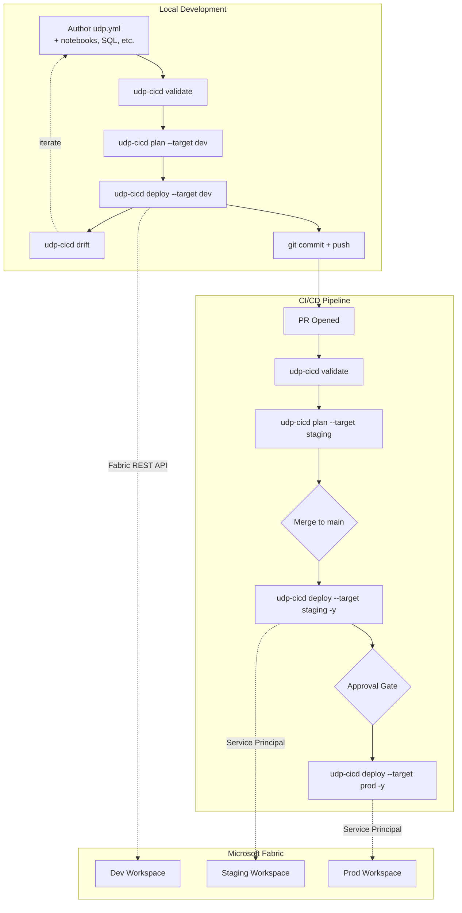

# Unified Data Platform Deployment

[](https://www.nuget.org/packages/udp-cicd/)
[](https://dotnet.microsoft.com/)
[](https://github.com/PatrickGallucci/udp-cicd/blob/main/LICENSE)
[](https://github.com/PatrickGallucci/udp-cicd/actions)
[](https://PatrickGallucci.github.io/udp-cicd/)

> **Public Preview** — 30 item types verified against the live Fabric API. Core workflows are production-ready. See [8.2 Tested Item Types](#82-tested-item-types).

---

## 1. Overview

Unified Data Platform Deployment (`udp-cicd`) is a declarative, Infrastructure-as-Code toolset for managing Microsoft Fabric projects. It allows data engineers to define their entire Fabric estate — lakehouses, notebooks, pipelines, semantic models, Data Agents, security roles, and environment targets — in a single manifest file (`udp.yml`), then validate, plan, and deploy with one command, ensuring reproducible deployments across development, staging, and production.

```bash
udp-cicd init --template medallion --name udp-project
udp-cicd validate
udp-cicd plan
udp-cicd deploy --target prod
```

[Read the full documentation →](https://PatrickGallucci.github.io/udp-cicd/)

### 1.1 Purpose and Scope

The project exists to close the **orchestration gap** in Microsoft Fabric. The Fabric CLI can export and import items, `fabric-cicd` can deploy across workspaces, and Terraform/Bicep can provision infrastructure — but none of them describe:

- What resources your project needs (lakehouses, notebooks, pipelines, semantic models, Data Agents)
- How those resources depend on each other
- How configuration varies across environments (dev/staging/prod)
- What security roles and permissions are required
- How to deploy everything in the correct order

`udp-cicd` provides a unified model that understands the dependencies between Fabric items and manages their lifecycle as a single project.

### 1.2 Key Capabilities

| Capability | Description |
|------------|-------------|
| Declarative manifests | Define desired state in `udp.yml`; the engine reconciles the workspace to match |
| Dependency management | Automatic topological sorting of resources for correct deployment order |
| State and drift | Tracks deployed resources in `deployment-state.json`; detects out-of-band portal changes |
| Multi-targeting | Environment-specific configuration (capacities, workspace names, variables) for dev/staging/prod |
| Resource coverage | 45 Fabric item types across all workloads, plus OneLake shortcuts |
| Reverse generation | Scan an existing workspace and produce a `udp.yml` you can customize |
| AI agent integration | MCP server exposes 12 deployment tools to Claude Code and GitHub Copilot |

### 1.3 System Architecture

The solution is built on **.NET 9** and divided into three functional areas:

| Project | Path | Responsibility |
|---------|------|----------------|
| **Core Engine** | `dotnet/src/UdpCicd.Core` | YAML parsing, dependency resolution, planning, state, Fabric API communication |
| **CLI Tool** | `dotnet/src/UdpCicd.Cli` | Command-line interface built with `System.CommandLine` for manual and automated execution |
| **MCP Server** | `dotnet/src/UdpCicd.Mcp` | Model Context Protocol server exposing deployment tools to AI agents |
| **Tests** | `dotnet/tests/UdpCicd.Core.Tests` | Unit and integration testing suite |

> **CLI naming:** The standalone CLI is `udp-cicd`. The MCP companion is `udp-cicd-mcp`.

---

## 2. Getting Started

### 2.1 Prerequisites

| Category | Requirement | Minimum Version / Details |
|----------|-------------|---------------------------|
| System | .NET SDK | 9.0+ |
| System | Azure CLI | 2.50+ (required for interactive auth) |
| Fabric | Capacity | Active Fabric capacity (F2 or higher) |
| Fabric | Permissions | Admin or Contributor role on target workspace |

### 2.2 Installation

`udp-cicd` is distributed as a .NET global tool:

```bash
# CLI
dotnet tool install --global udp-cicd

# MCP server (optional, for AI-assisted authoring)
dotnet tool install --global udp-cicd-mcp
```

Verify the installation with `diag`, which checks the .NET runtime, Azure CLI status, and Fabric API connectivity:

```bash
udp-cicd diag
```

### 2.3 Authentication

The tool uses the Azure Identity library (`Azure.Identity`) to resolve credentials. Resolution order:

1. If `AZURE_TENANT_ID`, `AZURE_CLIENT_ID`, and `AZURE_CLIENT_SECRET` are all present → `ClientSecretCredential` (service principal)
2. Otherwise → `DefaultAzureCredential` (managed identity, environment, or active `az login` session)
3. `FABRIC_USE_BROWSER=true` forces `InteractiveBrowserCredential`

```bash
# Local development (interactive)
az login
udp-cicd deploy --target dev

# CI/CD (service principal)
export AZURE_TENANT_ID=...
export AZURE_CLIENT_ID=...
export AZURE_CLIENT_SECRET=...
udp-cicd deploy --target prod -y
```

### 2.4 Quickstart: Template Project

The fastest start is the `medallion` template, which scaffolds a Bronze/Silver/Gold architecture:

```bash
# Interactive wizard — pick a template, name, and capacity
udp-cicd init

# Or specify directly
udp-cicd init --template medallion --name udp-analytics
```

Available templates: `blank` (empty), `medallion` (bronze/silver/gold lakehouse).

Retrieve your Fabric capacity GUID and update the `workspace` section of the generated `udp.yml`, then run the standard lifecycle:

```bash
udp-cicd validate
udp-cicd plan --target dev
udp-cicd deploy --target dev
```

### 2.5 Quickstart: Existing Workspace

```bash
udp-cicd generate --workspace "My Existing Workspace"
```

This scans the workspace and produces a `udp.yml` you can customize — the fastest on-ramp for existing projects.

### 2.6 Quickstart: From Scratch

```bash
mkdir udp-project && cd udp-project
```

Create a minimal `udp.yml`:

```yaml
deployment:
  name: udp-project
  version: "1.0.0"

resources:
  lakehouses:
    my_lakehouse:
      description: "My data store"

targets:
  dev:
    default: true
    workspace:
      name: udp-project-dev
      capacity_id: "your-capacity-guid"
```

```bash
udp-cicd validate
udp-cicd deploy --target dev
```

### 2.7 Plan Output (Dry-Run)

`udp-cicd plan --target dev` connects to Fabric and diffs desired state against actual state:

```
Deployment Plan: udp-analytics
  Target:    dev
  Workspace: udp-analytics-dev

  +  bronze-lakehouse      Lakehouse      create    New resource
  +  silver-lakehouse      Lakehouse      create    New resource
  +  gold-lakehouse        Lakehouse      create    New resource
  +  spark-env             Environment    create    New resource
  +  etl-bronze            Notebook       create    New resource
  +  etl-silver            Notebook       create    New resource
  +  daily-refresh         DataPipeline   create    New resource
  ~  analytics-model       SemanticModel  update    Definition updated

  Summary: 7 to create, 1 to update
```

---

## 3. CLI Reference

### 3.1 Commands

| Command | Description |
|---------|-------------|
| `udp-cicd init` | Create a new project from a template |
| `udp-cicd validate` | Validate the deployment definition (schema, references, dependency chains, targets) |
| `udp-cicd plan` | Preview changes (dry-run diff against workspace state) |
| `udp-cicd deploy` | Deploy to a target workspace |
| `udp-cicd destroy` | Tear down deployment resources |
| `udp-cicd generate` | Generate `udp.yml` from an existing workspace |
| `udp-cicd run <resource>` | Run a notebook or pipeline |
| `udp-cicd drift` | Detect drift between deployed state and live workspace |
| `udp-cicd bind` | Bind an existing workspace item |
| `udp-cicd admin plan` | Preview tenant (admin) setting changes against the live tenant |
| `udp-cicd admin apply` | Apply org-wide tenant settings via the Fabric Admin API |
| `udp-cicd list` | List available templates |
| `udp-cicd diag` | Diagnose environment, auth, and connectivity |

### 3.2 Common Flags

| Flag | Description |
|------|-------------|
| `-f, --file` | Path to `udp.yml` (default: auto-detect) |
| `-t, --target` | Target environment (dev, staging, prod) |
| `-y, --auto-approve` | Skip confirmation prompts |
| `--dry-run` | Preview without making changes |

### 3.3 MCP Server (GitHub Copilot / Claude Code)

```bash
dotnet tool install --global udp-cicd-mcp
```

**GitHub Copilot** — add to `.github/copilot-mcp.json` in your repo root:

```json
{
  "mcpServers": {
    "udp-cicd": {
      "command": "udp-cicd-mcp"
    }
  }
}
```

**Claude Code** — add to `.claude/settings.json`:

```json
{
  "mcpServers": {
    "udp-cicd": {
      "command": "udp-cicd-mcp"
    }
  }
}
```

Then just talk: *"Deploy to dev"*, *"Check for drift in prod"*, *"Run the ETL pipeline"*.

**14 MCP tools:** validate, plan, deploy, destroy, status, drift, run, history, diag, list-templates, list-workspaces, list-capacities, export, generate.

Copy the AI instructions file for your IDE to your project root:

| IDE | Copy this file | To your project |
|-----|---------------|-----------------|
| GitHub Copilot | [`examples/.github/copilot-instructions.md`](examples/.github/copilot-instructions.md) | `.github/copilot-instructions.md` |
| Claude Code | [`examples/CLAUDE.md`](examples/CLAUDE.md) | `CLAUDE.md` |

See the [MCP Server guide](https://PatrickGallucci.github.io/udp-cicd/guide/mcp-server/) and [Development Workflows](https://PatrickGallucci.github.io/udp-cicd/guide/development-workflows/).

---

## 4. Configuration Guide

### 4.1 The `udp.yml` Manifest

```yaml
deployment:
  name: udp-analytics
  version: "1.0.0"

workspace:
  capacity_id: "your-udp-capacity-guid"

resources:
  environments:
    spark-env:
      runtime: "1.3"
      libraries: [semantic-link-labs]

  lakehouses:
    bronze:
      description: "Raw data landing zone"
    gold:
      description: "Business-ready datasets"

  notebooks:
    etl-pipeline:
      path: ./notebooks/etl.py
      environment: spark-env
      default_lakehouse: bronze

  pipelines:
    daily-refresh:
      schedule:
        cron: "0 6 * * *"
        timezone: America/Chicago
      activities:
        - notebook: etl-pipeline

  semantic_models:
    analytics-model:
      path: ./semantic_model/
      default_lakehouse: gold

  reports:
    dashboard:
      path: ./reports/dashboard/
      semantic_model: analytics-model

  data_agents:
    udp-agent:
      sources: [gold]
      instructions: ./agent/instructions.md
      few_shot_examples: ./agent/examples.yaml

security:
  roles:
    - name: engineers
      entra_group: sg-data-eng
      workspace_role: contributor
    - name: analysts
      entra_group: sg-analysts
      workspace_role: viewer

# Org-wide Fabric tenant settings — applied tenant-wide via `udp-cicd admin apply`,
# never by `deploy`. Keyed by API settingName. See docs/guide/admin-settings.md.
admin:
  tenant_settings:
    PublishToWeb:
      enabled: false

targets:
  dev:
    default: true
    workspace:
      name: udp-analytics-dev
      capacity_id: "your-dev-capacity-guid"

  prod:
    workspace:
      name: udp-analytics-prod
    run_as:
      service_principal: sp-udp-prod
```

### 4.2 Variable Substitution

Use `${var.name}` in any string value, with per-target overrides:

```yaml
variables:
  adme_endpoint:
    description: "ADME endpoint"
    default: "https://dev.energy.azure.com"

targets:
  prod:
    variables:
      adme_endpoint: "https://prod.energy.azure.com"
```

Built-in deployment metadata is also available:

| Variable | Source |
|----------|--------|
| `${deployment.name}` | The `name` field in the `deployment` section |
| `${deployment.version}` | The `version` field in the `deployment` section |

### 4.3 Secrets Injection

The `SecretsResolver` replaces placeholders recursively across the manifest. Two patterns are supported:

| Pattern | Resolution |
|---------|-----------|
| `${secret.NAME}` | Resolved from the local environment (`Environment.GetEnvironmentVariable`) |
| `${keyvault.VAULT.SECRET}` | Resolved via Azure Key Vault `SecretClient`; results cached to minimize API calls |

Key Vault lookups authenticate with the same credential chain as the Fabric API (see [2.3](#23-authentication)).

### 4.4 Include Files

Split large deployments across multiple files:

```yaml
include:
  - resources/notebooks.yml
  - resources/pipelines.yml
  - security.yml
```

### 4.5 Templates

**`medallion`** — Bronze/Silver/Gold lakehouse architecture with:

- Three lakehouses with ETL notebooks
- Data pipeline with dependency chaining
- Semantic model and dashboard
- Data Agent with few-shot examples
- Security roles for engineers and analysts
- Dev/Staging/Prod targets

**`blank`** — minimal structure for new projects.

**Custom templates** — add a directory with a `template.yml` and a `udp.yml`. The template engine uses Scriban for scaffolding.

### 4.6 VS Code Integration

Get autocomplete and validation for `udp.yml` via the bundled JSON schema. Add `.vscode/settings.json`:

```json
{
    "yaml.schemas": {
        "./udp.schema.json": "udp.yml"
    }
}
```

Requires the [YAML extension](https://marketplace.visualstudio.com/items?itemName=redhat.vscode-yaml).

---

## 5. Core Architecture

### 5.1 Deployment Engine Pipeline

The engine is a linear five-stage pipeline. Each stage owns one aspect of the lifecycle:

| Stage | Component | Responsibility |
|-------|-----------|----------------|
| 1. Load | `Loader` / `YamlFactory` | Parse `udp.yml` (YamlDotNet) into a `DeploymentDefinition`; handle includes, variable substitution, schema validation |
| 2. Resolve | `Resolver` | Analyze resource relationships (e.g., a Notebook referencing a Lakehouse); topological sort for creation order |
| 3. Plan | `Planner` | Compare desired state (YAML) against current state to compute actions: Create, Update, Delete, No-op |
| 4. Deploy | `Deployer` | Execute the plan via `FabricClient`; update state after each successful operation |
| 5. State | `StateManager` | Maintain `deployment-state.json` — the record of truth for what has been deployed; powers drift detection and idempotency |

Dependency order is resolved automatically — you never have to think about what goes first:

```
environments → lakehouses → notebooks → pipelines
                          → warehouses
                          → semantic_models → reports
                          → data_agents
```

### 5.2 Core Data Models

Every element in `udp.yml` maps to a strongly typed C# class in `UdpCicd.Core.Models`:

| Entity | Code Identifier | Description |
|--------|-----------------|-------------|
| Root definition | `DeploymentDefinition` | Top-level container for a `udp.yml` file |
| Resource map | `ResourcesConfig` | Collection of all Fabric items (notebooks, lakehouses, etc.) |
| Target | `TargetConfig` | Environment-specific overrides (`prod` vs `dev`) |
| Workspace | `WorkspaceConfig` | Fabric workspace settings (ID, capacity, name) |
| State | `StateConfig` | State backend selection and settings |

### 5.3 State Backends

The `StateManager` keeps the engine idempotent and supports multiple backends:

| Backend | Use Case | Status |
|---------|----------|--------|
| Local JSON | Single developer, local iteration | Stable |
| Azure Blob | Team collaboration, remote locking (blob lease) | Beta |
| OneLake / ADLS Gen2 | State stored inside the Fabric ecosystem | Beta |

### 5.4 Generators

| Generator | Component | Function |
|-----------|-----------|----------|
| Reverse | `ReverseGenerator` | Scans an existing workspace via `FabricClient`; emits `udp.yml` plus source files (e.g., `.py` for notebooks) |
| Template | `TemplateEngine` (Scriban) | Scaffolds new projects from templates in `Assets/templates/` |

### 5.5 Repository Layout

```
dotnet/
├── src/
│   ├── UdpCicd.Core/
│   │   ├── Models/            # DeploymentDefinition + typed udp.yml schema
│   │   ├── Engine/            # Loader, Resolver, Planner, Deployer, StateManager, SecretsResolver, AdminApplier, ConnectionChecker
│   │   ├── Providers/         # FabricClient, FabricAuth (Fabric REST + Admin API)
│   │   ├── Generators/        # ReverseGenerator, TemplateEngine
│   │   └── Assets/templates/  # medallion/, blank/
│   ├── UdpCicd.Cli/           # System.CommandLine entry point
│   └── UdpCicd.Mcp/           # MCP server (14 tools)
└── tests/
    └── UdpCicd.Core.Tests/    # Unit + integration tests
```

---

## 6. CI/CD Integration

### 6.1 Developer Workflow



### 6.2 Pipeline Stage Reference

| Stage | Command | What happens |
|-------|---------|--------------|
| Local dev | `udp-cicd validate` | Schema validation, reference checks, dependency resolution |
| Local dev | `udp-cicd plan --target dev` | Connects to Fabric, diffs desired vs actual state |
| Local dev | `udp-cicd deploy --target dev` | Creates/updates resources in dev workspace |
| Local dev | `udp-cicd drift` | Detects out-of-band changes made in the portal |
| PR check | `udp-cicd validate` | Gate: blocks merge if deployment is invalid |
| PR check | `udp-cicd plan --target staging` | Informational: shows what the merge will change |
| CI deploy | `udp-cicd deploy --target staging -y` | Auto-deploys on merge, service principal auth |
| CI deploy | `udp-cicd deploy --target prod -y` | Deploys after manual approval gate |

### 6.3 GitHub Actions

Copy `cicd/github-actions.yml` to `.github/workflows/udp-cicd.yml`:

```yaml
- name: Deploy to Fabric
  run: |
    dotnet tool install --global udp-cicd
    udp-cicd deploy --target prod -y
  env:
    AZURE_TENANT_ID: ${{ secrets.AZURE_TENANT_ID }}
    AZURE_CLIENT_ID: ${{ secrets.AZURE_CLIENT_ID }}
    AZURE_CLIENT_SECRET: ${{ secrets.AZURE_CLIENT_SECRET }}
```

### 6.4 Azure DevOps

Copy `cicd/azure-devops.yml` to your repo as a YAML pipeline — includes validate, staging, and production stages with approval gates.

### 6.5 Pipeline Templates

[](https://github.com/PatrickGallucci/udp-udp-cicd-example/generate) [](https://github.com/PatrickGallucci/udp-udp-cicd-ado-example/generate)

Click to create your own repo with a working dev → test → prod pipeline. Add 5 secrets and push. Setup guides: [GitHub Actions](https://github.com/PatrickGallucci/udp-udp-cicd-example#setup) | [Azure DevOps](https://github.com/PatrickGallucci/udp-udp-cicd-ado-example#setup)

---

## 7. Supported Resource Types

**45 item types** across all Fabric workloads:

| Category | Types |
|----------|-------|
| Data Engineering | Lakehouse, Notebook, Environment, SparkJobDefinition, GraphQLApi, SnowflakeDatabase |
| Data Factory | DataPipeline, CopyJob, MountedDataFactory, ApacheAirflowJob, dbt Job |
| Data Warehouse | Warehouse, SQLDatabase, MirroredDatabase, MirroredWarehouse, MirroredDatabricksCatalog, CosmosDB, Datamart |
| Power BI | SemanticModel, Report, PaginatedReport, Dashboard, Dataflow |
| Data Science | MLModel, MLExperiment |
| Real-Time Intelligence | Eventhouse, Eventstream, KQLDatabase, KQLDashboard, KQLQueryset, Reflex, DigitalTwinBuilder, DigitalTwinBuilderFlow, EventSchemaSet, GraphQuerySet |
| AI & Knowledge | DataAgent, OperationsAgent, AnomalyDetector, Ontology |
| Other | VariableLibrary, UserDataFunction, Graph, GraphModel, Map, HLSCohort |

Plus **OneLake Shortcuts** (ADLS, S3, cross-workspace) as lakehouse sub-resources.

See the [Resource Types Guide](https://PatrickGallucci.github.io/udp-cicd/guide/resource-types/) for full details.

---

## 8. Reference

### 8.1 Environment Variables

| Variable | Purpose |
|----------|---------|
| `AZURE_TENANT_ID` | Azure AD tenant GUID (service principal auth) |
| `AZURE_CLIENT_ID` | Service principal application ID |
| `AZURE_CLIENT_SECRET` | Service principal client secret |
| `FABRIC_USE_BROWSER` | `true` forces interactive browser login |
| `FABRIC_CAPACITY_ID` | Capacity GUID for workspace creation during `deploy`/`init` |
| `AZURE_STORAGE_ACCOUNT_NAME` | Used with `azureblob` or `adls` state backends |

For Blob/ADLS state backends, omit the account key where possible — the system falls back to `DefaultAzureCredential` for storage access.

### 8.2 Tested Item Types

30 item types verified against a live Fabric workspace:

| Status | Item Types |
|--------|-----------|
| **Verified** (30) | Lakehouse, Notebook, DataPipeline, Warehouse, Environment, DataAgent, Eventhouse, KQLDatabase, KQLDashboard, KQLQueryset, Eventstream, Reflex, MLModel, MLExperiment, SparkJobDefinition, GraphQLApi, CopyJob, ApacheAirflowJob, Ontology, VariableLibrary, SQLDatabase, CosmosDBDatabase, MirroredAzureDatabricksCatalog, OperationsAgent, AnomalyDetector, DigitalTwinBuilder, GraphQuerySet, GraphModel, Map, UserDataFunction |
| **Capacity-gated** (4) | DataBuildToolJob, Graph, HLSCohort, EventSchemaSet |
| **Needs config** (2) | SnowflakeDatabase, DigitalTwinBuilderFlow |
| **List-only** (5) | Datamart, Dashboard, MirroredWarehouse, PaginatedReport, Dataflow |
| **Needs definition files** (4) | SemanticModel (TMDL), Report (PBIR), MirroredDatabase, MountedDataFactory |

### 8.3 Feature Stability

| Feature | Status | Notes |
|---------|--------|-------|
| validate, plan, deploy, destroy | **Stable** | Tested end-to-end against live API |
| drift, status, diff, history, diag | **Stable** | Tested against live workspaces |
| run (notebooks/pipelines) | **Stable** | Job submission works, LRO tracking limited |
| Security roles (workspace) | **Stable** | Entra user/group GUIDs |
| Connection reachability check | **Stable** | `validate`/`diag` TCP-probe each `connections` source (host:port from conn string or endpoint) |
| Incremental deploy (hash-based) | **Stable** | Skips unchanged resources |
| Deployment locking | **Stable** | Local + remote (blob lease) |
| CI/CD (GitHub Actions) | **Stable** | [Proven end-to-end](https://github.com/PatrickGallucci/udp-udp-cicd-example) |
| Remote state (OneLake, Blob, ADLS) | **Beta** | Built, not yet tested live |
| MCP server | **Beta** | 14 tools verified locally |
| Tenant/admin settings | **Beta** | Declarative tenant settings via Admin API (`admin plan`/`apply`); diff unit-tested, live apply unverified |
| OneLake data access roles | **Beta** | Built, not yet tested live |
| Environment publish (libraries) | **Beta** | Fire-and-forget, can't track completion |
| watch, promote, canary | **Experimental** | Built, untested |
| Notifications (Slack/Teams) | **Experimental** | Built, untested |
| Policy enforcement | **Experimental** | Built, untested |
| Shortcut transformations | **Experimental** | Model defined, API untested |

---

## 9. Contributing

Contributions welcome. See [CONTRIBUTING.md](CONTRIBUTING.md) for details.

```bash
git clone https://github.com/PatrickGallucci/udp-cicd.git
cd udp-cicd/dotnet
dotnet build
dotnet test
```

## 10. License

MIT
