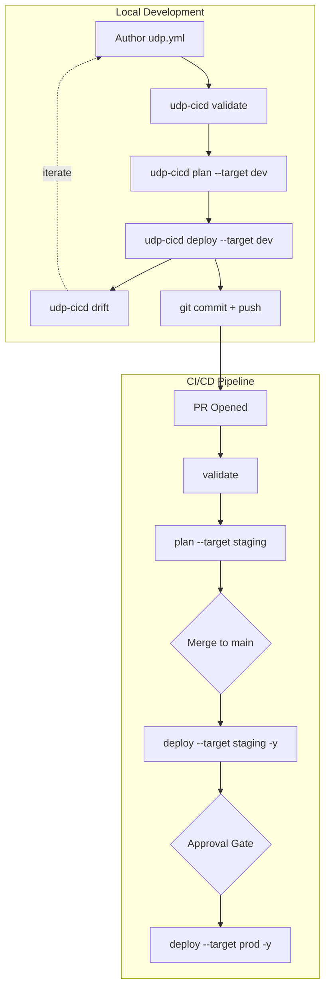

# Unified Data Platform Deployment

[](https://www.nuget.org/packages/udp-cicd/)
[](https://dotnet.microsoft.com/)
[](https://github.com/PatrickGallucci/udp-cicd/blob/main/LICENSE)
[](https://github.com/PatrickGallucci/udp-cicd/actions)
[](https://PatrickGallucci.github.io/udp-cicd/)
[](https://deepwiki.com/PatrickGallucci/udp-cicd)

> **Public Preview** — 30 Fabric item types verified against the live API; core workflows are production-ready. Entra and Azure resource providers are new in 1.9 and validated end-to-end in tests. See [9.2 Tested Item Types](#92-tested-item-types).

---

## 1. Overview

Unified Data Platform Deployment (`udp-cicd`) is a declarative, Infrastructure-as-Code toolset for managing a Microsoft data estate from a single manifest. You define your **Microsoft Fabric** items — lakehouses, notebooks, pipelines, semantic models, Data Agents — together with the **Microsoft Entra** identities and **Azure** resources they depend on, in one `udp.yml`, then validate, plan, and deploy with one command across dev, staging, and production.

```bash
udp-cicd init --template medallion --name udp-project
udp-cicd validate
udp-cicd plan --target prod
udp-cicd deploy --target prod
```

[Read the full documentation →](https://PatrickGallucci.github.io/udp-cicd/)

### 1.1 Purpose and Scope

The project exists to close the **orchestration gap** across a Microsoft data platform. The Fabric CLI can import and export items, `fabric-cicd` can deploy across workspaces, and Terraform/Bicep can provision infrastructure — but none of them describe, in one place:

- What resources your project needs — Fabric items, Entra groups/apps, Azure services
- How those resources depend on each other
- How configuration varies across environments (dev/staging/prod)
- What security roles and permissions are required
- How to deploy everything, in the correct order, idempotently

`udp-cicd` provides a unified model that understands those dependencies and manages their lifecycle as a single project.

### 1.2 Key Capabilities

| Capability | Description |
|------------|-------------|
| Declarative manifests | Define desired state in `udp.yml`; the engine reconciles each control plane to match |
| Multi-platform | One manifest spans **Fabric** (REST), **Entra** (Microsoft Graph), and **Azure** (Bicep via `az`) |
| Dependency management | Automatic topological sorting of resources for correct deployment order |
| State and drift | Tracks deployed resources in `deployment-state.json`; detects out-of-band portal changes |
| Multi-targeting | Environment-specific configuration (capacities, workspace names, variables) for dev/staging/prod |
| Resource coverage | 46 Fabric item types + Entra groups/apps + **64 Azure service types** |
| Reverse generation | Scan an existing workspace and produce a `udp.yml` you can customize |
| AI agent integration | MCP server exposes 14 deployment tools to Claude Code and GitHub Copilot |

### 1.3 Lineage and Credit

`udp-cicd` began as a .NET port of [**fabric-automation-bundles**](https://github.com/dereknguyenio/fabric-automation-bundles) by **Derek Nguyen** — the Python `fab-bundle` tool that pioneered the declarative, single-manifest model for Microsoft Fabric (one `fabric.yml`, topological dependency resolution, plan/deploy, drift, reverse generation, MCP). udp-cicd reimplements that model on .NET 9 and **extends it across two further control planes** (Microsoft Entra and Azure). The engine layout deliberately mirrors the original (`Loader` / `Resolver` / `Planner` / `Deployer` / providers / generators). Full acknowledgment in [§10](#10-acknowledgments).

### 1.4 System Architecture

The solution is built on **.NET 9** and divided into functional areas:

| Project | Path | Responsibility |
|---------|------|----------------|
| **Core Engine** | `dotnet/src/UdpCicd.Core` | YAML parsing, dependency resolution, planning, state; Fabric / Graph / Azure providers |
| **CLI Tool** | `dotnet/src/UdpCicd.Cli` | Command-line interface (`System.CommandLine`) for manual and automated runs |
| **MCP Server** | `dotnet/src/UdpCicd.Mcp` | Model Context Protocol server exposing deployment tools to AI agents |
| **Editor** | `dotnet/src/UdpCicd.Editor` | WinForms `udp.yml` editor (Windows) |
| **Tests** | `dotnet/tests/UdpCicd.Core.Tests` | Unit and integration suite |

> **CLI naming:** The standalone CLI is `udp-cicd`. The MCP companion is `udp-cicd-mcp`.

---

## 2. Getting Started

### 2.1 Prerequisites

| Category | Requirement | Minimum Version / Details |
|----------|-------------|---------------------------|
| System | .NET SDK | 9.0+ |
| System | Azure CLI | 2.50+ (interactive auth; required for the Azure provider) |
| Fabric | Capacity | Active Fabric capacity (F2 or higher) |
| Fabric | Permissions | Admin or Contributor role on target workspace |
| Entra | Permissions | Graph `Group.ReadWrite.All` / `Application.ReadWrite.All` (only if you declare `entra_*` resources) |
| Azure | Permissions | Rights on the target subscription (only if you declare `azure_*` resources) |

### 2.2 Installation

`udp-cicd` is distributed as a .NET global tool:

```bash
# CLI
dotnet tool install --global udp-cicd

# MCP server (optional, for AI-assisted authoring)
dotnet tool install --global udp-cicd-mcp
```

Verify with `diag`, which checks the .NET runtime, Azure CLI status, and Fabric API connectivity:

```bash
udp-cicd diag
```

### 2.3 Authentication

The tool uses the Azure Identity library (`Azure.Identity`) to resolve credentials. Resolution order:

1. If `AZURE_TENANT_ID`, `AZURE_CLIENT_ID`, and `AZURE_CLIENT_SECRET` are all present → `ClientSecretCredential` (service principal)
2. Otherwise → `DefaultAzureCredential` (managed identity, environment, or active `az login` session)
3. `FABRIC_USE_BROWSER=true` forces `InteractiveBrowserCredential`

The same credential chain backs Fabric, Graph (Entra), and Key Vault. The Azure provider shells out to `az`, so it uses your active `az login` context.

```bash
# Local development (interactive)
az login
udp-cicd deploy --target dev

# CI/CD (service principal)
export AZURE_TENANT_ID=...
export AZURE_CLIENT_ID=...
export AZURE_CLIENT_SECRET=...
udp-cicd deploy --target prod -y
```

### 2.4 Quickstart: Template Project

```bash
# Interactive wizard — pick a template, name, and capacity
udp-cicd init

# Or specify directly
udp-cicd init --template medallion --name udp-analytics
```

Available templates: `blank` (empty), `medallion` (bronze/silver/gold lakehouse), `all-resource-types` (reference catalogue of all 46 Fabric item types), `realtime-governance` (IoT → Eventhouse → Eventstream + Azure governance, with an Azure DevOps pipeline).

Retrieve your Fabric capacity GUID, update the `workspace` section, then run the standard lifecycle:

```bash
udp-cicd validate
udp-cicd plan --target dev
udp-cicd deploy --target dev
```

### 2.5 Quickstart: Existing Workspace

```bash
udp-cicd generate --workspace "My Existing Workspace"
```

Scans the workspace and produces a `udp.yml` you can customize — the fastest on-ramp for existing projects.

### 2.6 Quickstart: From Scratch

```bash
mkdir udp-project && cd udp-project
```

Create a minimal `udp.yml`:

```yaml
deployment:
  name: udp-project
  version: "1.0.0"

resources:
  lakehouses:
    my_lakehouse:
      description: "My data store"

targets:
  dev:
    default: true
    workspace:
      name: udp-project-dev
      capacity_id: "your-capacity-guid"
```

```bash
udp-cicd validate
udp-cicd deploy --target dev
```

### 2.7 Plan Output (Dry-Run)

`udp-cicd plan --target dev` connects to Fabric and diffs desired state against actual state:

```
Deployment Plan: udp-analytics
  Target:    dev
  Workspace: udp-analytics-dev

  +  bronze-lakehouse      Lakehouse      create    New resource
  +  silver-lakehouse      Lakehouse      create    New resource
  +  gold-lakehouse        Lakehouse      create    New resource
  +  spark-env             Environment    create    New resource
  +  etl-bronze            Notebook       create    New resource
  ~  analytics-model       SemanticModel  update    Definition updated
```

---

## 3. CLI Reference

### 3.1 Commands

| Command | Description |
|---------|-------------|
| `udp-cicd init` | Create a new project from a template |
| `udp-cicd validate` | Validate the deployment definition (schema, references, dependency chains, targets) |
| `udp-cicd plan` | Preview changes (dry-run diff against workspace state) |
| `udp-cicd deploy` | Deploy to a target workspace |
| `udp-cicd destroy` | Tear down deployment resources |
| `udp-cicd generate` | Generate `udp.yml` from an existing workspace |
| `udp-cicd run <resource>` | Run a notebook or pipeline |
| `udp-cicd drift` | Detect drift between deployed state and live workspace |
| `udp-cicd bind` | Bind an existing workspace item |
| `udp-cicd admin plan` | Preview tenant (admin) setting changes against the live tenant |
| `udp-cicd admin apply` | Apply org-wide tenant settings via the Fabric Admin API |
| `udp-cicd list` | List available templates |
| `udp-cicd diag` | Diagnose environment, auth, and connectivity |

### 3.2 Common Flags

| Flag | Description |
|------|-------------|
| `-f, --file` | Path to `udp.yml` (default: auto-detect) |
| `-t, --target` | Target environment (dev, staging, prod) |
| `-y, --auto-approve` | Skip confirmation prompts |
| `--dry-run` | Preview without making changes |
| `--continue-on-error` | (deploy) Keep created items on failure instead of rolling back |

### 3.3 MCP Server (GitHub Copilot / Claude Code)

```bash
dotnet tool install --global udp-cicd-mcp
```

**GitHub Copilot** — add to `.github/copilot-mcp.json`; **Claude Code** — add to `.claude/settings.json`:

```json
{
  "mcpServers": {
    "udp-cicd": {
      "command": "udp-cicd-mcp"
    }
  }
}
```

Then just talk: *"Deploy to dev"*, *"Check for drift in prod"*, *"Run the ETL pipeline"*.

**14 MCP tools:** validate, plan, deploy, destroy, status, drift, run, history, diag, list-templates, list-workspaces, list-capacities, export, generate.

See the [MCP Server guide](https://PatrickGallucci.github.io/udp-cicd/guide/mcp-server/) and [Development Workflows](https://PatrickGallucci.github.io/udp-cicd/guide/development-workflows/).

---

## 4. Configuration Guide

### 4.1 The `udp.yml` Manifest

```yaml
deployment:
  name: udp-analytics
  version: "1.0.0"

workspace:
  capacity_id: "your-udp-capacity-guid"

resources:
  environments:
    spark-env:
      runtime: "1.3"
      libraries: [semantic-link-labs]

  lakehouses:
    bronze:
      description: "Raw data landing zone"
    gold:
      description: "Business-ready datasets"

  notebooks:
    etl-pipeline:
      path: ./notebooks/etl.py
      environment: spark-env
      default_lakehouse: bronze

  semantic_models:
    analytics-model:
      path: ./semantic_model/
      default_lakehouse: gold

security:
  roles:
    - name: engineers
      entra_group: sg-data-eng
      workspace_role: contributor

targets:
  dev:
    default: true
    workspace:
      name: udp-analytics-dev
      capacity_id: "your-dev-capacity-guid"
```

### 4.2 Variable Substitution

Use `${var.name}` in any string value, with per-target overrides:

```yaml
variables:
  adme_endpoint:
    description: "ADME endpoint"
    default: "https://dev.energy.azure.com"

targets:
  prod:
    variables:
      adme_endpoint: "https://prod.energy.azure.com"
```

Built-in metadata is also available: `${deployment.name}`, `${deployment.version}`.

### 4.3 Secrets Injection

The `SecretsResolver` replaces placeholders recursively across the manifest:

| Pattern | Resolution |
|---------|-----------|
| `${secret.NAME}` | Resolved from the local environment (`Environment.GetEnvironmentVariable`) |
| `${keyvault.VAULT.SECRET}` | Resolved via Azure Key Vault `SecretClient`; results cached |

Key Vault lookups authenticate with the same credential chain as the Fabric API (see [2.3](#23-authentication)).

### 4.4 Include Files

```yaml
include:
  - resources/notebooks.yml
  - resources/pipelines.yml
  - security.yml
```

### 4.5 Templates

**`medallion`** — Bronze/Silver/Gold lakehouse with ETL notebooks, a dependency-chained pipeline, semantic model and dashboard, a Data Agent, security roles, and dev/staging/prod targets. **`blank`** — minimal structure. **`all-resource-types`** — reference catalogue declaring all 46 Fabric item types. **`realtime-governance`** — IoT Hub → Fabric Eventhouse/Eventstream/Activator + Lakehouse, Data Agent, Materialized Lake Views, and Azure governance (Key Vault, Policy, Defender, Monitor, Sentinel), shipping an Azure DevOps pipeline. Custom templates use Scriban scaffolding.

### 4.6 VS Code Integration

Get autocomplete and validation for `udp.yml` via the bundled JSON schema:

```json
{
  "yaml.schemas": {
    "./udp.schema.json": "udp.yml"
  }
}
```

Requires the [YAML extension](https://marketplace.visualstudio.com/items?itemName=redhat.vscode-yaml).

---

## 5. Multi-Platform Resources

A single `udp.yml` can declare resources on three control planes. Each resource type is tagged with a **platform** that selects the provider used to deploy it. Fabric is the default; Entra and Azure types are addressed by their own top-level keys.

| Platform | Control plane | Deployed via | Scope | Auth |
|----------|---------------|--------------|-------|------|
| **Fabric** | Microsoft Fabric items | Fabric REST API | Workspace | Fabric token |
| **Entra** | Directory objects | Microsoft Graph | Tenant | Graph `*.ReadWrite.All` |
| **Azure** | ARM resources | Bicep through the `az` CLI | Subscription / resource group | `az login` |

```yaml
azure:
  subscription: "${var.subscription_id}"
  location: eastus

resources:
  # Fabric (workspace)
  lakehouses:
    analytics_lh: { description: "Analytics workload" }

  # Entra (tenant, via Graph) — idempotent create-or-patch by display name
  entra_groups:
    sg-analytics-readers: { security_enabled: true }
  entra_apps:
    analytics-ingest-app: { create_service_principal: true }

  # Azure (ARM via Bicep)
  azure_resource_groups:
    rg-analytics-dev: { location: eastus }
  azure_key_vaults:
    kv-analytics:
      resource_group: rg-analytics-dev
  azure_virtual_networks:
    vnet-hub:
      resource_group: rg-analytics-dev
      properties: { addressSpace: { addressPrefixes: ["10.0.0.0/16"] } }
```

See the [Multi-platform guide](https://PatrickGallucci.github.io/udp-cicd/guide/multi-platform/) and examples [10](examples/10-azure-and-entra/), [11](examples/11-azure-data-services/), and [12](examples/12-azure-platform-services/).

> **Note** — The deploy engine is workspace-centric: a deployment containing only Entra/Azure resources still creates a Fabric workspace. Mixed and Fabric-only deployments are unaffected.

---

## 6. Core Architecture

### 6.1 Deployment Engine Pipeline

The engine is a linear five-stage pipeline:

| Stage | Component | Responsibility |
|-------|-----------|----------------|
| 1. Load | `Loader` / `YamlFactory` | Parse `udp.yml` into a `DeploymentDefinition`; includes, variable substitution, schema validation |
| 2. Resolve | `Resolver` | Analyze resource relationships; topological sort for creation order |
| 3. Plan | `Planner` | Diff desired vs current state → Create / Update / Delete / No-op |
| 4. Deploy | `Deployer` | Execute the plan, dispatching each item to its platform provider; update state |
| 5. State | `StateManager` | Maintain `deployment-state.json` — record of truth, powering drift and idempotency |

### 6.2 Platform Providers

Non-Fabric resources deploy through an `IResourcePlatformProvider`, selected per item by its `ResourcePlatform` tag in the resource registry:

| Provider | Platform | Client |
|----------|----------|--------|
| `Deployer` (inline) | Fabric | `FabricClient` (REST + Admin API) |
| `EntraResourceProvider` | Entra | `GraphClient` (Microsoft Graph) |
| `AzureResourceProvider` | Azure | `AzureCli` (`az deployment` + Bicep) |

The Azure provider emits generated Bicep for first-class service types (driven by an ARM-type → API-version table), or deploys an author-supplied `.bicep` via `azure_deployments`.

### 6.3 State Backends

| Backend | Use Case | Status |
|---------|----------|--------|
| Local JSON | Single developer, local iteration | Stable |
| Azure Blob | Team collaboration, remote locking (blob lease) | Beta |
| OneLake / ADLS Gen2 | State stored inside the Fabric ecosystem | Beta |

### 6.4 Repository Layout

```
dotnet/
├── src/
│   ├── UdpCicd.Core/
│   │   ├── Models/            # DeploymentDefinition + typed udp.yml schema + ResourceTypeRegistry
│   │   ├── Engine/            # Loader, Resolver, Planner, Deployer, StateManager, SecretsResolver, ...
│   │   ├── Providers/         # FabricClient, GraphClient, AzureCli + Platforms/ (Entra, Azure)
│   │   ├── Generators/        # ReverseGenerator, TemplateEngine
│   │   └── Assets/templates/  # medallion/, blank/, all-resource-types/
│   ├── UdpCicd.Cli/           # System.CommandLine entry point
│   ├── UdpCicd.Mcp/           # MCP server (14 tools)
│   └── UdpCicd.Editor/        # WinForms udp.yml editor (Windows)
└── tests/
    └── UdpCicd.Core.Tests/    # Unit + integration tests
```

---

## 7. CI/CD Integration

### 7.1 Developer Workflow


```mermaid
flowchart TB
    subgraph local["Local Development"]
        A["Author udp.yml"] --> B["udp-cicd validate"]
        B --> C["udp-cicd plan --target dev"]
        C --> D["udp-cicd deploy --target dev"]
        D --> E["udp-cicd drift"]
        E -.->|"iterate"| A
        D --> F["git commit + push"]
    end

    subgraph cicd["CI/CD Pipeline"]
        G["PR Opened"] --> H["validate"]
        H --> I["plan --target staging"]
        I --> J{Merge to main}
        J --> K["deploy --target staging -y"]
        K --> L{Approval Gate}
        L --> M["deploy --target prod -y"]
    end

    F --> G
```

### 7.2 GitHub Actions

Copy `cicd/github-actions.yml` to `.github/workflows/udp-cicd.yml`:

```yaml
- name: Deploy to Fabric
  run: |
    dotnet tool install --global udp-cicd
    udp-cicd deploy --target prod -y
  env:
    AZURE_TENANT_ID: ${{ secrets.AZURE_TENANT_ID }}
    AZURE_CLIENT_ID: ${{ secrets.AZURE_CLIENT_ID }}
    AZURE_CLIENT_SECRET: ${{ secrets.AZURE_CLIENT_SECRET }}
```

### 7.3 Azure DevOps

Copy `cicd/azure-devops.yml` to your repo as a YAML pipeline — validate, staging, and production stages with approval gates.

---

## 8. Supported Resource Types

### 8.1 Microsoft Fabric (46 item types)

| Category | Types |
|----------|-------|
| Data Engineering | Lakehouse, Notebook, Environment, SparkJobDefinition, GraphQLApi, SnowflakeDatabase, MaterializedLakeView |
| Data Factory | DataPipeline, CopyJob, MountedDataFactory, ApacheAirflowJob, dbt Job |
| Data Warehouse | Warehouse, SQLDatabase, MirroredDatabase, MirroredWarehouse, MirroredDatabricksCatalog, CosmosDB, Datamart |
| Power BI | SemanticModel, Report, PaginatedReport, Dashboard, Dataflow |
| Data Science | MLModel, MLExperiment |
| Real-Time Intelligence | Eventhouse, Eventstream, KQLDatabase, KQLDashboard, KQLQueryset, Reflex, DigitalTwinBuilder, DigitalTwinBuilderFlow, EventSchemaSet, GraphQuerySet |
| AI & Knowledge | DataAgent, OperationsAgent, AnomalyDetector, Ontology |
| Other | VariableLibrary, UserDataFunction, Graph, GraphModel, Map, HLSCohort |

Plus **OneLake Shortcuts** (ADLS, S3, cross-workspace) as lakehouse sub-resources.

### 8.2 Microsoft Entra

`entra_groups` (security groups) and `entra_apps` (app registrations + optional service principal), deployed via Microsoft Graph at tenant scope.

### 8.3 Azure (64 service types via Bicep)

| Group | Type keys |
|-------|-----------|
| Foundations | `azure_resource_groups`, `azure_storage_accounts`, `azure_deployments` (generic Bicep) |
| Storage | `azure_blob_storage`, `azure_data_lake_storage`, `azure_files`, `azure_queue_storage`, `azure_table_storage` |
| Integration / streaming / compute | `azure_data_factories`, `azure_databricks_workspaces`, `azure_databricks_structured_streaming`, `azure_event_hub_namespaces`, `azure_event_grid_topics`, `azure_stream_analytics_jobs`, `azure_iot_hubs`, `azure_logic_apps`, `azure_functions` |
| Databases | `azure_sql_databases`, `azure_sql_managed_instances`, `azure_sql_virtual_machines`, `azure_postgresql`, `azure_mysql`, `azure_mariadb`, `azure_cosmosdb_accounts`, `azure_redis_cache`, `azure_data_box` |
| Governance / security / AI | `azure_purview_accounts`, `azure_key_vaults`, `azure_policy_assignments`, `azure_defender_plans`, `azure_machine_learning_workspaces`, `azure_ai_foundry`, `azure_sentinel`, `azure_video_indexer`, `azure_openai`, `azure_load_testing`, `azure_agent_ids`, `azure_service_groups` |
| Monitoring / observability | `azure_monitor_components`, `azure_alerts`, `azure_diagnostic_settings`, `azure_log_analytics_workspaces`, `azure_metrics`, `azure_workbooks`, `azure_activity_logs`, `azure_database_watchers` |
| Networking | `azure_network_watchers`, `azure_dns_zones`, `azure_network_interfaces`, `azure_private_dns_zones`, `azure_public_ip_addresses`, `azure_route_tables`, `azure_virtual_networks`, `azure_local_network_gateways`, `azure_peering_services`, `azure_peerings`, `azure_virtual_network_gateways`, `azure_virtual_wans`, `azure_ddos_protection_plans`, `azure_firewalls`, `azure_ip_groups`, `azure_network_security_groups`, `azure_application_gateways`, `azure_application_security_groups` |

See the [Resource Types Guide](https://PatrickGallucci.github.io/udp-cicd/guide/resource-types/) for the full reference.

---

## 9. Reference

### 9.1 Environment Variables

| Variable | Purpose |
|----------|---------|
| `AZURE_TENANT_ID` | Azure AD tenant GUID (service principal auth) |
| `AZURE_CLIENT_ID` | Service principal application ID |
| `AZURE_CLIENT_SECRET` | Service principal client secret |
| `FABRIC_USE_BROWSER` | `true` forces interactive browser login |
| `FABRIC_CAPACITY_ID` | Capacity GUID for workspace creation during `deploy`/`init` |
| `AZURE_STORAGE_ACCOUNT_NAME` | Used with `azureblob` or `adls` state backends |

### 9.2 Tested Item Types

30 Fabric item types verified against a live workspace:

| Status | Item Types |
|--------|-----------|
| **Verified** (30) | Lakehouse, Notebook, DataPipeline, Warehouse, Environment, DataAgent, Eventhouse, KQLDatabase, KQLDashboard, KQLQueryset, Eventstream, Reflex, MLModel, MLExperiment, SparkJobDefinition, GraphQLApi, CopyJob, ApacheAirflowJob, Ontology, VariableLibrary, SQLDatabase, CosmosDBDatabase, MirroredAzureDatabricksCatalog, OperationsAgent, AnomalyDetector, DigitalTwinBuilder, GraphQuerySet, GraphModel, Map, UserDataFunction |
| **List-only** (5) | Datamart, Dashboard, MirroredWarehouse, PaginatedReport, Dataflow |
| **Needs definition files** (4) | SemanticModel (TMDL), Report (PBIR), MirroredDatabase, MountedDataFactory |

### 9.3 Feature Stability

| Feature | Status | Notes |
|---------|--------|-------|
| validate, plan, deploy, destroy | **Stable** | Tested end-to-end against live Fabric API |
| drift, status, diff, history, diag | **Stable** | Tested against live workspaces |
| Incremental deploy (hash-based) | **Stable** | Skips unchanged resources |
| CI/CD (GitHub Actions) | **Stable** | [Proven end-to-end](https://github.com/PatrickGallucci/udp-udp-cicd-example) |
| Entra provider (groups/apps) | **Beta** | Graph create/patch/delete, unit-tested against a mocked Graph |
| Azure provider (64 service types) | **Beta** | Bicep emit + `az deployment`, unit-tested; live deploy depends on service-specific properties |
| Remote state (OneLake, Blob, ADLS) | **Beta** | Built, not yet tested live |
| MCP server | **Beta** | 14 tools verified locally |
| Tenant/admin settings | **Beta** | Declarative tenant settings via Admin API |

---

## 10. Acknowledgments

udp-cicd is a .NET reimplementation of [**fabric-automation-bundles**](https://github.com/dereknguyenio/fabric-automation-bundles) by **Derek Nguyen**. That project established the declarative, single-manifest model for Microsoft Fabric — schema-validated config, topological dependency resolution, plan/deploy/drift, reverse generation from existing workspaces, and MCP-based AI assistance. udp-cicd ports those ideas to .NET 9 and extends them across Microsoft Entra and Azure. Thank you to Derek for the original design and tooling.

---

## 11. Contributing

Contributions welcome. See [CONTRIBUTING.md](CONTRIBUTING.md).

```bash
git clone https://github.com/PatrickGallucci/udp-cicd.git
cd udp-cicd/dotnet
dotnet build
dotnet test
```

## 12. License

MIT
