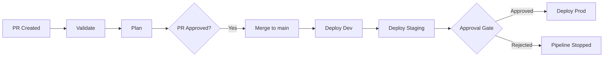

# CI/CD Overview

This page explains why continuous integration and deployment apply to Microsoft Fabric, describes the standard udp-cicd pipeline and its authentication model, and compares the supported CI/CD platforms. Platform-specific pipeline files are provided in [GitHub Actions](github-actions.md) and [Azure DevOps](azure-devops.md).

---

## 1. Why CI/CD for Microsoft Fabric

Managing Fabric resources manually through the portal works for a single developer building a prototype. It breaks down the moment a second person touches the workspace, or the moment the same project must be deployed to staging and production. CI/CD for Fabric provides four properties:

| Property | Description |
|---|---|
| Consistency | Every environment is deployed from the same deployment definition. No forgotten manual steps, no "it works on my workspace" problems. |
| Repeatability | Deployments are deterministic. Running the same pipeline twice with the same inputs produces the same workspace state. |
| Auditability | Every change goes through source control. Pull requests create a review trail. Deployment logs record who deployed what, when, and to which target. |
| Safety | Validation catches errors before they reach a workspace. Plan output shows exactly what will change. Approval gates prevent unreviewed changes from reaching production. |

---

## 2. The deployment pipeline

A standard udp-cicd pipeline follows this flow:

1. A developer opens a **pull request** with changes to `udp.yml`, notebooks, SQL scripts, or other definitions.
2. The CI pipeline runs **validate** to check schema correctness and policy compliance, then runs **plan** to preview what would change in the target workspace.
3. Reviewers approve and **merge** the pull request.
4. The CD pipeline automatically **deploys to dev**.
5. After dev deployment succeeds, the pipeline **deploys to staging** (optionally with automated tests).
6. A manual **approval gate** is required before **deploying to production**.



### 2.1 Pipeline stages in detail

| Stage | Command | Trigger | Authentication Required | Purpose |
|-------|---------|---------|------------------------|---------|
| Validate | `udp-cicd validate --strict` | PR opened/updated | No | Schema and policy checks against local files |
| Plan | `udp-cicd plan --target dev` | PR opened/updated | Yes | Dry-run diff against the live workspace |
| Deploy Dev | `udp-cicd deploy --target dev -y` | Merge to main | Yes | Deploy to the development workspace |
| Deploy Staging | `udp-cicd deploy --target staging -y` | After dev succeeds | Yes | Deploy to the staging workspace |
| Deploy Prod | `udp-cicd deploy --target prod -y` | After manual approval | Yes | Deploy to the production workspace |
| Drift Check | `udp-cicd drift --target prod` | Scheduled (cron) | Yes | Detect out-of-band changes |

Every pipeline installs the CLI as a .NET global tool before running any command:

```bash
dotnet tool install --global udp-cicd
```

---

## 3. Authentication in CI/CD

udp-cicd authenticates to the Fabric API through its `FabricAuth` component, built on the Azure.Identity library. Credential selection follows this order:

| Condition | Credential used |
|-----------|-----------------|
| `AZURE_TENANT_ID`, `AZURE_CLIENT_ID`, and `AZURE_CLIENT_SECRET` are all set | `ClientSecretCredential` (service principal) |
| `FABRIC_USE_BROWSER=true` | `InteractiveBrowserCredential` (interactive browser sign-in) |
| Otherwise | `DefaultAzureCredential` (managed identity, Azure CLI session, and other standard sources) |

No interactive browser login is needed in CI/CD. Use a service principal or a managed identity.

### 3.1 Service principal (client secret)

The most common approach. Set three environment variables in your CI/CD runner:

| Variable | Description |
|----------|-------------|
| `AZURE_TENANT_ID` | Your Entra ID (Azure AD) tenant GUID |
| `AZURE_CLIENT_ID` | The app registration's application (client) ID |
| `AZURE_CLIENT_SECRET` | A client secret for the app registration |

When all three variables are set, udp-cicd authenticates with `ClientSecretCredential`.

See [Service Principal Setup](../guide/service-principal.md) for step-by-step instructions on creating and configuring the service principal.

### 3.2 Managed identity

For Azure-hosted CI/CD runners (Azure DevOps Microsoft-hosted agents with managed identity, self-hosted runners on Azure VMs, or GitHub Actions runners on Azure), you can use managed identity instead of a client secret. No environment variables are required. When the service principal variables are not set, udp-cicd falls back to `DefaultAzureCredential`, which discovers the identity automatically.

This is the most secure option because there is no secret to rotate or leak.

---

## 4. Environment protection

Both GitHub Actions and Azure DevOps support approval gates that prevent deployments to sensitive environments without human review.

### 4.1 GitHub Actions

Create environments in your repository settings (Settings > Environments) and add required reviewers:

| Environment | Protection Rules |
|-------------|-----------------|
| `dev` | None (auto-deploy on merge) |
| `staging` | None, or require specific reviewers |
| `production` | Required reviewers, wait timer (optional) |

Reference the environment in your workflow with `environment: production`. GitHub will pause the job and request approval before it runs.

### 4.2 Azure DevOps

Create environments in Pipelines > Environments and add approval checks:

| Environment | Approvals |
|-------------|-----------|
| `dev` | None |
| `staging` | None |
| `production` | Required approvers |

Reference the environment in your pipeline with `environment: 'production'`. Azure DevOps will pause the stage and request approval.

---

## 5. GitHub Actions vs Azure DevOps

| Capability | GitHub Actions | Azure DevOps |
|-----------|---------------|--------------|
| Workflow definition | `.github/workflows/*.yml` | `azure-pipelines.yml` |
| Secrets management | Repository or environment secrets | Variable groups (with Key Vault linking) |
| Approval gates | Environment protection rules | Environment approvals and checks |
| Scheduled runs | `on: schedule` with cron syntax | `schedules:` trigger |
| Manual trigger | `on: workflow_dispatch` | Manual trigger on pipeline |
| Matrix strategy | `strategy: matrix` | `strategy: matrix` |
| Artifact sharing | `actions/upload-artifact` | Pipeline artifacts |
| Self-hosted runners | Self-hosted runners | Self-hosted agents |

Both platforms are fully supported. The GitHub Actions workflows have been proven end-to-end against live Fabric workspaces; the Azure DevOps pipeline covers validate, staging, and production stages with approval gates. Choose whichever your team already uses.

---

## 6. Next steps

- [GitHub Actions](github-actions.md) -- Full workflow files for CI, CD, drift checks, and destroy.
- [Azure DevOps](azure-devops.md) -- Complete pipeline YAML with stages, environments, and variable groups.
- [Service Principal Setup](../guide/service-principal.md) -- Create and configure the service principal for CI/CD.
- [Secrets Management](../guide/secrets.md) -- Handle connection strings and credentials in pipelines.
